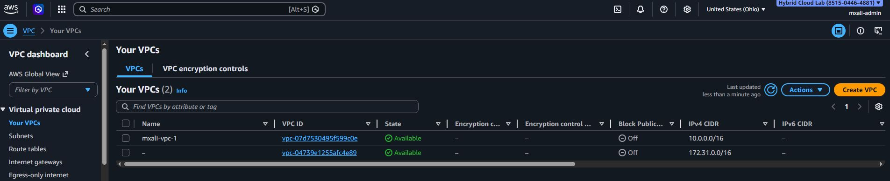
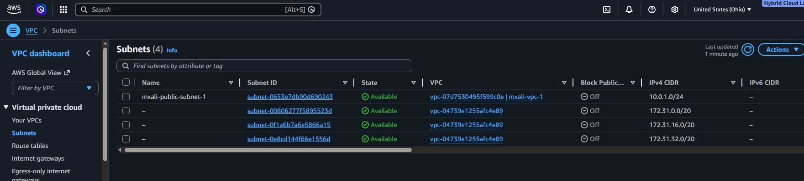
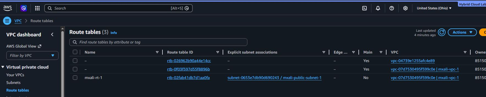
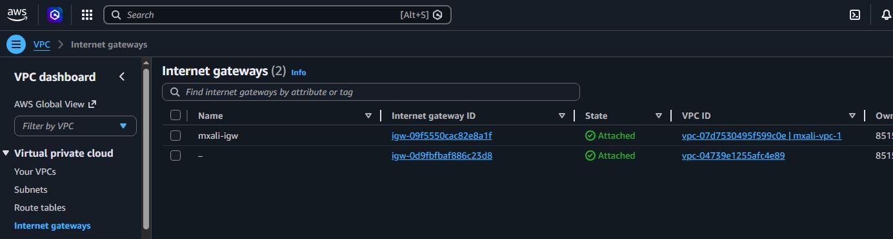
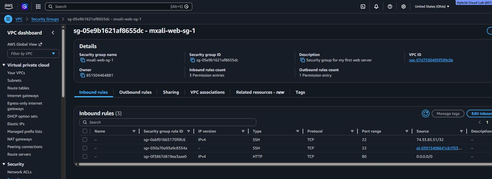
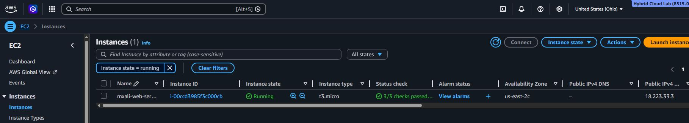
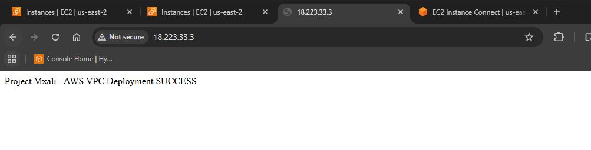

# 🚀 Project 1 — AWS VPC + EC2 Web Server Deployment

## 📌 Overview
Designed and deployed a production-style AWS infrastructure environment including custom VPC networking, routing, security controls, and a public-facing EC2 web server.

---

## 🏗️ Architecture
- VPC CIDR: 10.0.0.0/16  
- Public Subnet: 10.0.1.0/24  
- Internet Gateway attached  
- Route Table configured with internet access  
- EC2 (Amazon Linux) deployed in public subnet  
- Apache web server hosting a public page  

---
## ⚙️ Key Components/Services Used
- Amazon VPC  
- Subnets  
- Route Tables  
- Internet Gateway  
- EC2  
- Security Groups 

---

## 🔐 Security
- SSH access restricted to specific IP  
- HTTP access open for public web traffic  
- Security Group used as virtual firewall  

---

## Deployment Steps
1. Created a custom VPC
2. Created a public subnet
3. Enabled auto-assign public IPv4
4. Created and attached an Internet Gateway
5. Created a Route Table and added `0.0.0.0/0` route to the Internet Gateway
6. Associated the Route Table with the public subnet
7. Created a Security Group for SSH and HTTP
8. Launched an EC2 instance in the custom VPC
9. Connected to the instance and installed Apache
10. Verified public website access from browser

---

## Troubleshooting
- During deployment, I initially could not connect to the EC2 instance using EC2 Instance Connect.

---

## 🌐 Outcome
Successfully deployed a publicly accessible web server using custom AWS networking infrastructure.

---

## 📸 Screenshots
### VPC

### Subnet

### Route Table

### Internet Gateway

### Security Group

### EC2 Instance

### Website

## 👨‍💻 Author
**MXALI**  
