# Serverless Task API (AWS)

## 📌 Project Overview

This project demonstrates a fully serverless backend application built on AWS. It allows users to create and retrieve tasks using a RESTful API powered by API Gateway, AWS Lambda, and DynamoDB.

---

## 🏗️ Architecture

Client → API Gateway → Lambda → DynamoDB

---

## ⚙️ AWS Services Used

* API Gateway (HTTP API)
* AWS Lambda (Python)
* DynamoDB (NoSQL database)
* IAM (Permissions & Roles)
* CloudWatch (Logs & Monitoring)

---

## 🚀 Features

* Create tasks (POST /tasks)
* Retrieve tasks (GET /tasks)
* Serverless architecture (no servers to manage)
* Fully integrated AWS services

---

## 📂 Project Structure

```
serverless-api/
 ├── README.md
 ├── screenshots/
```
---

## 📸 Screenshots

### DynamoDB Table
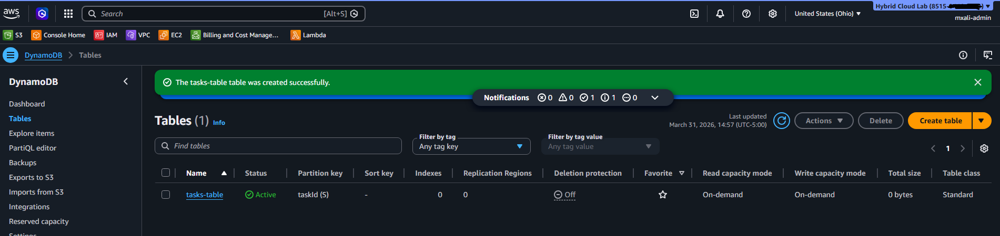

### Lambda Function
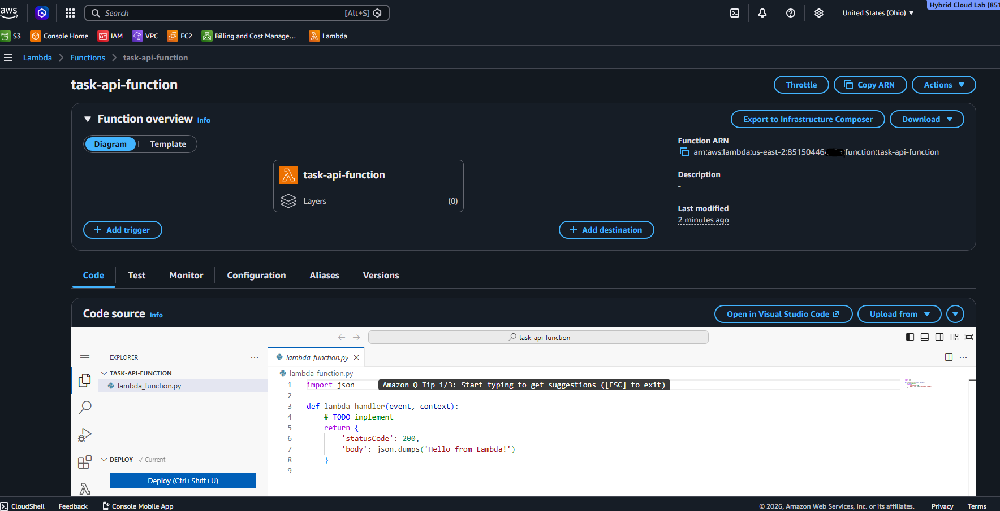

### Lambda Permissions
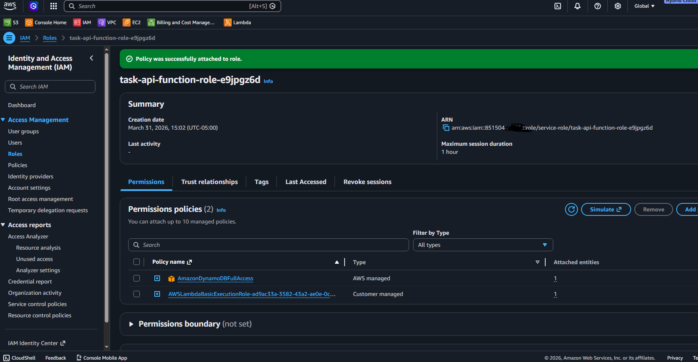

### Lambda Code
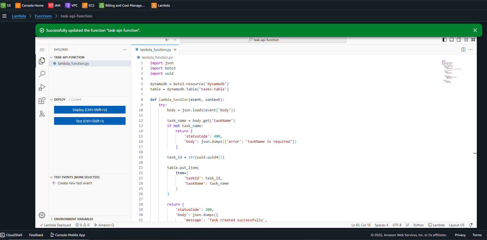

### Lambda Test Result
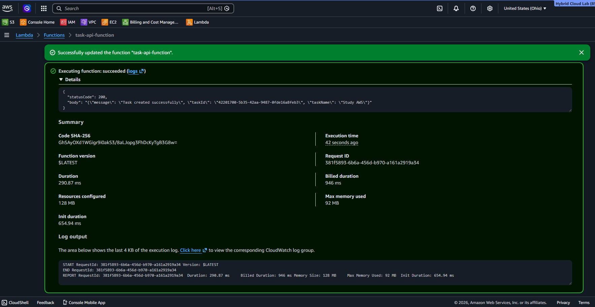

### Dynamodb Item List
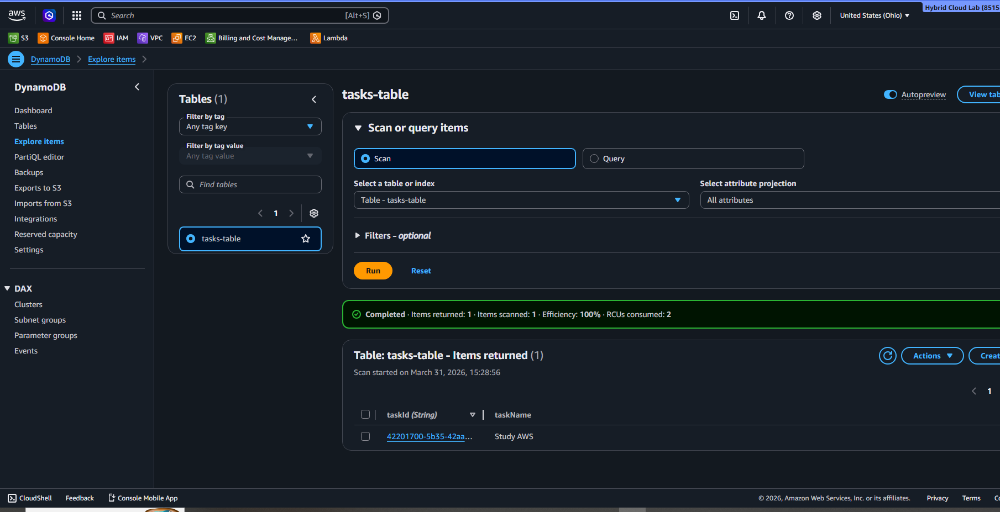

### Create API
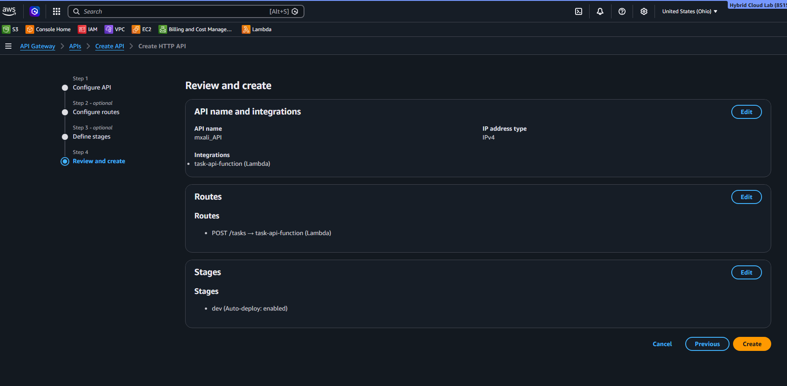

### API Invoke URL
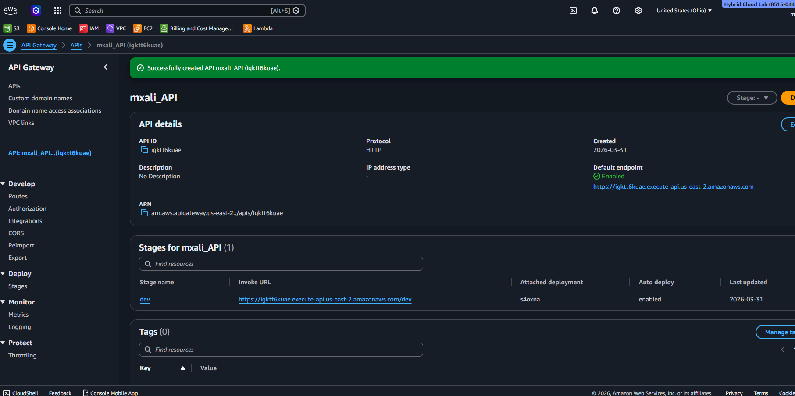

### POST Request Test
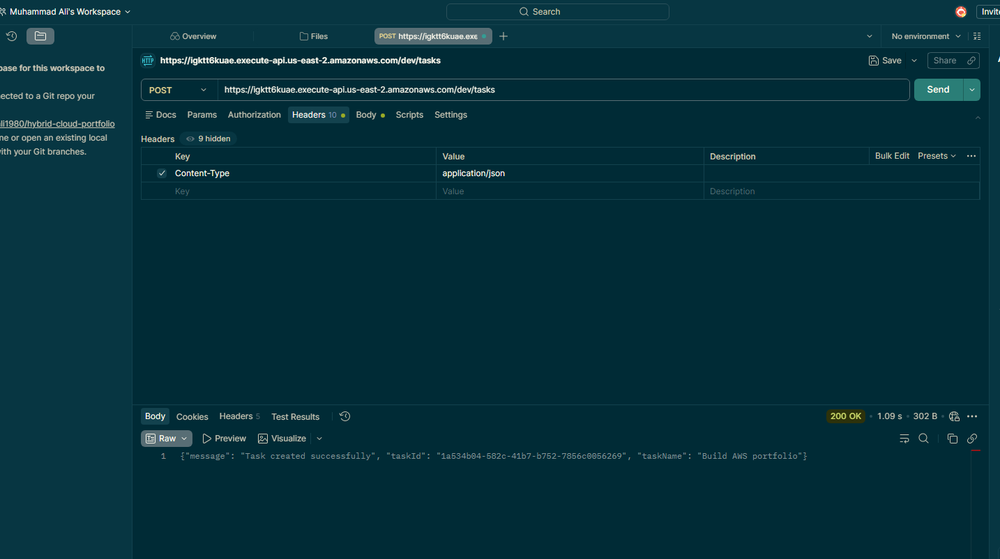

### Dynamodb Item
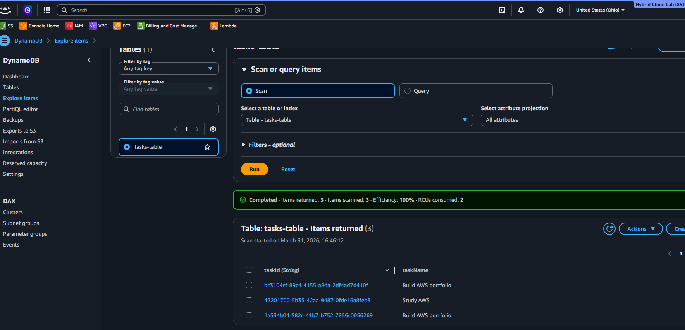

### API Gateway Routes
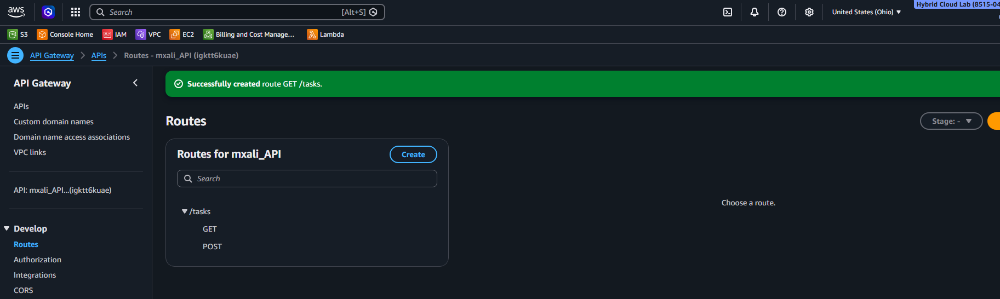

### GET Request Test
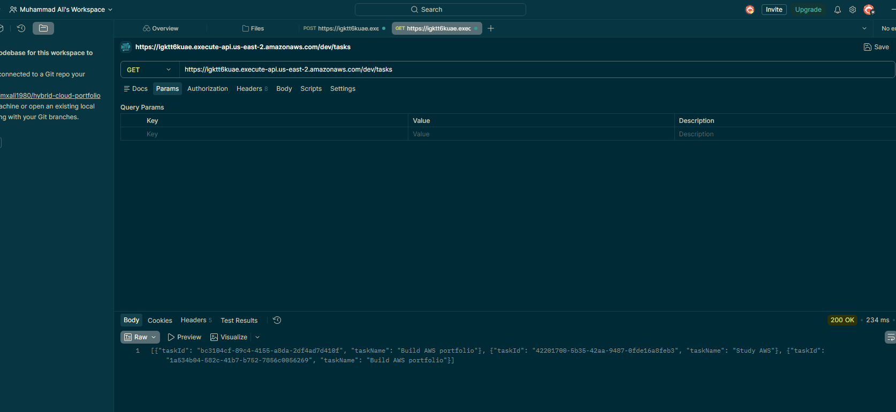

---

## ⚠️ Troubleshooting

* Fixed IAM permission issue for Lambda → DynamoDB access
* Verified Lambda execution via test events
* Resolved API request formatting issues (JSON body format)
* GET failed initially but resolved it by adding Integration details under GET Route

---

## 🔮 Future Improvements

* Add PUT and DELETE endpoints
* Add task status (completed/pending)
* Add authentication (Cognito / JWT)
* Add frontend UI (React)

---

## 👨‍💻 Author

MxAli
